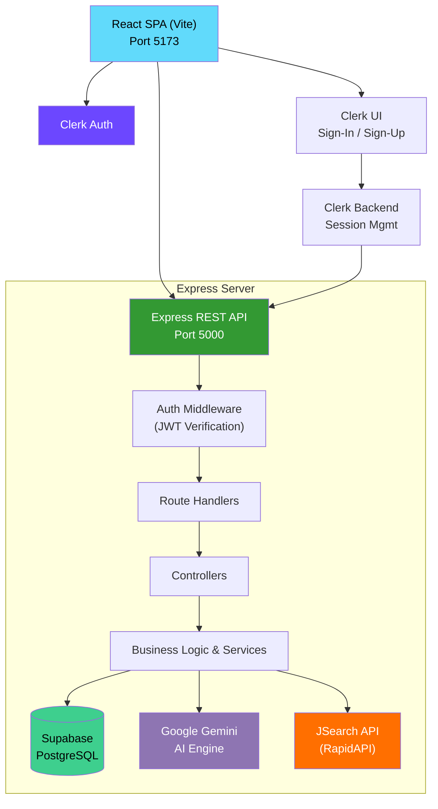

# AutoApply AI

<p align="center">
  <strong>AI-powered job automation platform — import, analyze, match, and apply for jobs intelligently.</strong>
</p>

<p align="center">
  
  
  
  
  
  
  
  
</p>

---

## Table of Contents

- [Overview](#overview)
- [Features](#features)
- [Tech Stack](#tech-stack)
- [Architecture](#architecture)
- [Folder Structure](#folder-structure)
- [Prerequisites](#prerequisites)
- [Installation](#installation)
- [Environment Variables](#environment-variables)
- [Database](#database)
- [API Overview](#api-overview)
- [Screenshots](#screenshots)
- [Future Roadmap](#future-roadmap)
- [Contributing](#contributing)
- [License](#license)
- [Author](#author)

---

## Overview

AutoApply AI is a full-stack web application that transforms the job search experience. It imports real job listings via the JSearch API, uses Google Gemini to analyze resumes against job descriptions, generates AI-powered match scores and recommendations, tracks applications through every stage, and provides career intelligence — including resume scoring, market readiness, skill gap analysis, and personalized learning roadmaps.

Whether you are a job seeker looking to streamline your search or a developer exploring AI-powered SaaS architecture, AutoApply AI demonstrates a production-grade integration of modern authentication (Clerk), serverless PostgreSQL (Supabase), and generative AI (Gemini) behind a polished React dashboard.

---

## Features

### Authentication
- Secure sign-up and sign-in powered by **Clerk**
- Protected frontend routes with Clerk React SDK
- JWT session tokens validated on every backend request via Clerk Express middleware
- Webhook-based user creation and synchronization

### Dashboard
- Personalized landing view with key metrics at a glance
- Real-time import pipeline status and history
- Resume score, market readiness percentage, and AI-generated insights
- Application statistics (total, saved, applied, interviews)
- Recent activity feed

### Job Import
- Search and import real job listings from the **JSearch API** (RapidAPI)
- Duplicate prevention using unique job IDs per user
- Import history with status tracking (pending, processing, completed, failed)
- Per-user job isolation
- Import locking to prevent concurrent duplicate imports
- Stale import recovery for crashed or interrupted imports

### AI Recommendations
- AI-powered job matching using **Google Gemini 2.0**
- Per-job match score (0–100) with weighted breakdown
- Skill matching — what you have vs. what the job requires
- Missing skills identification and prioritization
- Natural language recommendation reasoning
- Resume compatibility percentages

### Career Intelligence
- **Resume Score** — comprehensive evaluation of resume quality and completeness
- **Market Readiness** — how prepared you are for your target roles
- **Role Readiness** — specific readiness for software engineering, data science, etc.
- **Missing Skills** — ranked list of skills to acquire for your desired career path
- **Learning Roadmap** — personalized step-by-step learning plan with resources
- **Career Analysis** — trajectory insights based on your profile and market trends

### Resume Management
- Upload resumes in PDF format
- AI-powered parsing via Gemini to extract skills, experience, education, and projects
- Apply parsed data directly to your structured profile
- Resume scoring with actionable improvement suggestions

### Profile Management
- Structured profile with skills, experience, education, projects
- Preferred roles and employment preferences
- Profile completeness tracking
- Synchronized with parsed resume data

### Application Tracking
- Save jobs for later review
- Track applied jobs with status (applied, interviewing, offer, rejected)
- Interview stage management
- Full application lifecycle from discovery to offer

---

## Tech Stack

| Layer | Technology | Purpose |
|-------|-----------|---------|
| Frontend | React 19, React Router 7, Vite | UI framework, routing, build tool |
| Styling | Tailwind CSS 4, Framer Motion | Utility-first styling, animations |
| Authentication | Clerk (React SDK + Express SDK) | User auth, session management, webhooks |
| Backend | Node.js, Express 5 | REST API server |
| Database | Supabase (PostgreSQL) | Data storage, real-time, Row Level Security |
| AI | Google Gemini 2.0 (genai SDK) | Resume parsing, job matching, career analysis |
| Job Data | JSearch API (RapidAPI) | Real-world job listing import |
| File Upload | Multer | Resume file handling |
| Background Jobs | Node.js worker | Asynchronous job import processing |

---

## Architecture



**Data Flow**

1. A user signs in via **Clerk** — the frontend receives a JWT session token.
2. The React app calls the **Express API** with the session token in the `Authorization` header.
3. The **Auth middleware** validates the JWT with Clerk and attaches the user ID to the request.
4. **Controllers** delegate to **Services** that contain all business logic.
5. Services interact with **Supabase** for data persistence and **Gemini** for AI operations.
6. Job listings are fetched from **JSearch**, deduplicated, and stored per user.
7. Career analysis and recommendations are computed on-demand via Gemini and cached in Supabase.

---

## Folder Structure

```
AutoApply-AI
│
├── client/                          # React frontend (Vite)
│   ├── public/
│   │   ├── favicon.svg
│   │   └── icons.svg
│   ├── src/
│   │   ├── assets/                  # Static images and icons
│   │   ├── components/              # Reusable UI components
│   │   │   ├── applications/        # Application card, filters, badges
│   │   │   ├── resume/              # Resume uploader, card, skeleton
│   │   │   ├── AIInsights.jsx       # AI recommendation insights
│   │   │   ├── CareerSnapshot.jsx   # Career overview snapshot
│   │   │   ├── CircularScore.jsx    # SVG circular score component
│   │   │   ├── InsightMetricCard.jsx# Metric card for AI insights
│   │   │   ├── JobCard.jsx          # Job listing card
│   │   │   ├── QuickStatCard.jsx    # Quick stat display card
│   │   │   ├── Sidebar.jsx          # Navigation sidebar
│   │   │   ├── Topbar.jsx           # Top navigation bar
│   │   │   └── ...                  # Other UI components
│   │   ├── pages/                   # Route-level page components
│   │   │   ├── DashboardPage.jsx    # Main dashboard
│   │   │   ├── ApplicationsPage.jsx # Application tracking
│   │   │   ├── JobDetailPage.jsx    # Single job view
│   │   │   ├── ResumePage.jsx       # Resume management
│   │   │   ├── SignInPage.jsx       # Clerk sign-in
│   │   │   └── SignUpPage.jsx       # Clerk sign-up
│   │   ├── services/                # API client functions
│   │   ├── utils/                   # Auth utilities
│   │   ├── App.jsx                  # Root component
│   │   ├── main.jsx                 # Entry point
│   │   └── index.css                # Global styles (Tailwind)
│   ├── .env                         # Environment variables
│   ├── .gitignore
│   ├── eslint.config.js
│   ├── index.html
│   ├── package.json
│   └── vite.config.js
│
├── server/                          # Express REST API
│   ├── migrations/                  # SQL migration files
│   │   ├── 001_add_structured_profile_fields.sql
│   │   ├── 002_add_job_columns.sql
│   │   ├── 003_add_explanation_cache.sql
│   │   └── 004_add_career_analysis.sql
│   ├── src/
│   │   ├── config/
│   │   │   └── supabase.js          # Supabase client initialization
│   │   ├── controllers/
│   │   │   ├── application.controller.js
│   │   │   ├── careerAnalysis.controller.js
│   │   │   ├── dashboard.controller.js
│   │   │   ├── job.controller.js
│   │   │   ├── jobRecommendation.controller.js
│   │   │   ├── profile.controller.js
│   │   │   ├── resume.controller.js
│   │   │   └── webhook.controller.js
│   │   ├── middleware/
│   │   │   ├── auth.js              # JWT verification middleware
│   │   │   ├── upload.js            # File upload (Multer)
│   │   │   └── withSupabase.js      # Supabase client injection
│   │   ├── routes/
│   │   │   ├── application.route.js
│   │   │   ├── careerAnalysis.route.js
│   │   │   ├── dashboard.route.js
│   │   │   ├── job.route.js
│   │   │   ├── profile.route.js
│   │   │   ├── recommendation.route.js
│   │   │   ├── resume.route.js
│   │   │   └── webhook.route.js
│   │   ├── services/
│   │   │   ├── application.service.js
│   │   │   ├── careerAnalysis.service.js
│   │   │   ├── careerAnalysisOrchestrator.js
│   │   │   ├── dashboard.service.js
│   │   │   ├── job.service.js
│   │   │   ├── jobExplanation.service.js
│   │   │   ├── jobImport.service.js
│   │   │   ├── jobParser.service.js
│   │   │   ├── jobQuery.service.js
│   │   │   ├── jobRecommendation.service.js
│   │   │   ├── jobimporter.js
│   │   │   ├── jsearch.service.js
│   │   │   ├── profile.service.js
│   │   │   ├── resume.service.js
│   │   │   ├── resumeParser.service.js
│   │   │   └── user.service.js
│   │   ├── utils/
│   │   │   ├── gemini.js            # Gemini API client
│   │   │   ├── normalize.js         # Data normalization utilities
│   │   │   └── skillNormalizer.js   # Skill name standardization
│   │   ├── workers/
│   │   │   └── jobImport.worker.js  # Background job import worker
│   │   ├── app.js                   # Express app setup
│   │   └── server.js                # Server entry point
│   ├── .env
│   ├── .gitignore
│   └── package.json
│
├── .gitignore
└── README.md
```

---

## Prerequisites

Before you begin, ensure you have the following:

- **Node.js 18+** and **npm**
- A **Supabase** project (free tier works) — [Create one here](https://supabase.com)
- A **Clerk** application — [Create one here](https://clerk.com)
- A **RapidAPI** account with access to the **JSearch API** — [Get it here](https://rapidapi.com/letscrape-6bRBa3QguO5/api/jsearch)
- A **Google Gemini API key** — [Get one here](https://aistudio.google.com/apikey)

---

## Installation

### 1. Clone the repository

```bash
git clone https://github.com/codewitharyan-bit/AutoApply-Ai.git
cd AutoApply-Ai
```

### 2. Server setup

```bash
cd server
npm install
```

### 3. Client setup

```bash
cd client
npm install
```

### 4. Configure environment variables

Copy the environment templates below into `server/.env` and `client/.env` with your actual credentials.

### 5. Run database migrations

Execute the SQL files in `server/migrations/` against your Supabase SQL editor in order:

1. `001_add_structured_profile_fields.sql`
2. `002_add_job_columns.sql`
3. `003_add_explanation_cache.sql`
4. `004_add_career_analysis.sql`

### 6. Start the application

```bash
# Terminal 1 — Server
cd server
npm run dev

# Terminal 2 — Client
cd client
npm run dev
```

- **Client:** http://localhost:5173
- **Server:** http://localhost:5000

---

## Environment Variables

### Client (`client/.env`)

| Variable | Description |
|----------|-------------|
| `VITE_CLERK_PUBLISHABLE_KEY` | Clerk publishable key from your Clerk dashboard |
| `VITE_API_BASE_URL` | Backend API base URL (default: `http://localhost:5000/api`) |

### Server (`server/.env`)

| Variable | Required | Description |
|----------|----------|-------------|
| `PORT` | Yes | API server port (default: `5000`) |
| `CLIENT_URL` | Yes | Allowed CORS origin (default: `http://localhost:5173`) |
| `SUPABASE_URL` | Yes | Supabase project URL |
| `SUPABASE_ANON_KEY` | Yes | Supabase anon / public key (used for RLS) |
| `SUPABASE_SECRET_KEY` | Yes | Supabase service role key (bypasses RLS) |
| `CLERK_SECRET_KEY` | Yes | Clerk backend secret key |
| `CLERK_PUBLISHABLE_KEY` | Yes | Clerk frontend API key (used for webhook verification) |
| `CLERK_WEBHOOK_SECRET` | Yes | Clerk webhook signing secret |
| `SUPABASE_JWKS_URL` | Yes | Supabase JWKS endpoint for JWT verification |
| `DATABASE_URL` | Yes | Full PostgreSQL connection string (`postgresql://...`) |
| `GEMINI_API_KEY` | Yes | Google Gemini API key |
| `RAPIDAPI_KEY` | Yes | RapidAPI key for JSearch |
| `RAPIDAPI_HOST` | Yes | JSearch API host (`jsearch.p.rapidapi.com`) |

---

## Database

AutoApply AI uses **Supabase** (PostgreSQL) with the following core tables:

| Table | Description |
|-------|-------------|
| `users` | Synced from Clerk webhooks; stores user ID and basic info |
| `profiles` | Structured profile data (skills, experience, education, projects, preferences) |
| `jobs` | Imported job listings with metadata (source URL, company, location, salary) |
| `job_recommendations` | AI-generated match scores per user per job with reasoning and skill breakdown |
| `applications` | Application lifecycle tracking (saved, applied, interviewing, offer, rejected) |
| `resumes` | Uploaded resume files with parsed JSON data |
| `import_logs` | Job import job tracking (status, timestamps, error details) |
| `career_analysis` | Cached career analysis results with skill gaps and learning roadmap |

Row Level Security (RLS) policies ensure users can only access their own data.

---

## API Overview

All endpoints are prefixed with `/api` and require a valid Clerk JWT in the `Authorization: Bearer <token>` header (except webhooks).

### Authentication

| Method | Endpoint | Description |
|--------|----------|-------------|
| POST | `/api/webhooks/clerk` | Clerk user created / updated webhook |

### Profile

| Method | Endpoint | Description |
|--------|----------|-------------|
| GET | `/api/profile` | Get the authenticated user's profile |
| PUT | `/api/profile` | Update profile (skills, experience, education, projects) |

### Jobs

| Method | Endpoint | Description |
|--------|----------|-------------|
| GET | `/api/jobs` | List jobs (with filters, pagination) |
| GET | `/api/jobs/:id` | Get single job details |
| POST | `/api/jobs/import` | Trigger job import from JSearch |
| GET | `/api/jobs/import/status` | Get import pipeline status |

### Recommendations

| Method | Endpoint | Description |
|--------|----------|-------------|
| GET | `/api/recommendations` | Get AI-powered job recommendations for the user |
| GET | `/api/recommendations/:id` | Get detailed explanation for a specific recommendation |

### Career Analysis

| Method | Endpoint | Description |
|--------|----------|-------------|
| POST | `/api/career-analysis` | Run or retrieve career analysis (resume score, readiness, skill gaps, roadmap) |

### Dashboard

| Method | Endpoint | Description |
|--------|----------|-------------|
| GET | `/api/dashboard` | Aggregated dashboard data (stats, metrics, recent activity) |

### Applications

| Method | Endpoint | Description |
|--------|----------|-------------|
| GET | `/api/applications` | List user's applications |
| POST | `/api/applications` | Save / apply for a job |
| PATCH | `/api/applications/:id` | Update application status |
| DELETE | `/api/applications/:id` | Remove an application |

### Resume

| Method | Endpoint | Description |
|--------|----------|-------------|
| POST | `/api/resumes/upload` | Upload a resume PDF |
| GET | `/api/resumes` | List uploaded resumes |
| GET | `/api/resumes/:id` | Get resume details with parsed data |
| POST | `/api/resumes/:id/parse` | Trigger AI parsing on an uploaded resume |
| POST | `/api/resumes/:id/apply` | Apply parsed resume data to user profile |

---

## Screenshots

> Screenshots will be added to the `docs/` folder in a future update.

| Page | Preview |
|------|---------|
| **Landing Page** |  |
| **Dashboard** |  |
| **Job Listings** |  |
| **AI Recommendations** |  |
| **Career Intelligence** |  |
| **Resume Management** |  |
| **Profile** |  |

---

## Future Roadmap

- [ ] **Auto Apply Engine** — fully automated job application submission
- [ ] **ATS Resume Optimization** — tailor resumes for Applicant Tracking Systems
- [ ] **AI Interview Preparation** — generate practice questions and model answers
- [ ] **Salary Prediction** — estimate expected salary based on role, location, and experience
- [ ] **Resume Versioning** — track and compare different resume versions
- [ ] **Email Automation** — follow-up reminders and application status notifications
- [ ] **Analytics Dashboard** — deeper insights into application success rates and trends
- [ ] **Browser Extension** — import jobs from LinkedIn, Indeed, and other platforms

---

## Contributing

Contributions are welcome! Please follow these steps:

1. Fork the repository
2. Create a new branch: `git checkout -b feature/your-feature-name`
3. Make your changes
4. Commit with clear messages: `git commit -m "Add feature: your feature description"`
5. Push to your fork: `git push origin feature/your-feature-name`
6. Open a Pull Request

Please ensure your code follows the existing style conventions and passes any lint checks.

---

## License

This project is licensed under the **MIT License**. See the [LICENSE](LICENSE) file for details.

---

## Author

### Aryan Rana

Full Stack Developer & AI Enthusiast

<p align="left">
  <a href="https://github.com/codewitharyan-bit">
    
  </a>
  <a href="https://www.linkedin.com/in/aryan-rana-5813a92b3/">
    
  </a>
  <a href="https://aryan-rana.vercel.app">
    
  </a>
</p>
